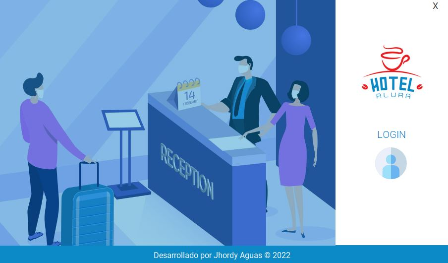
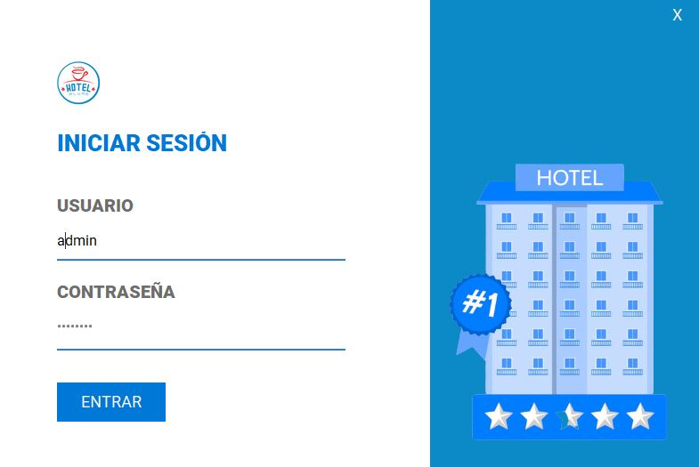
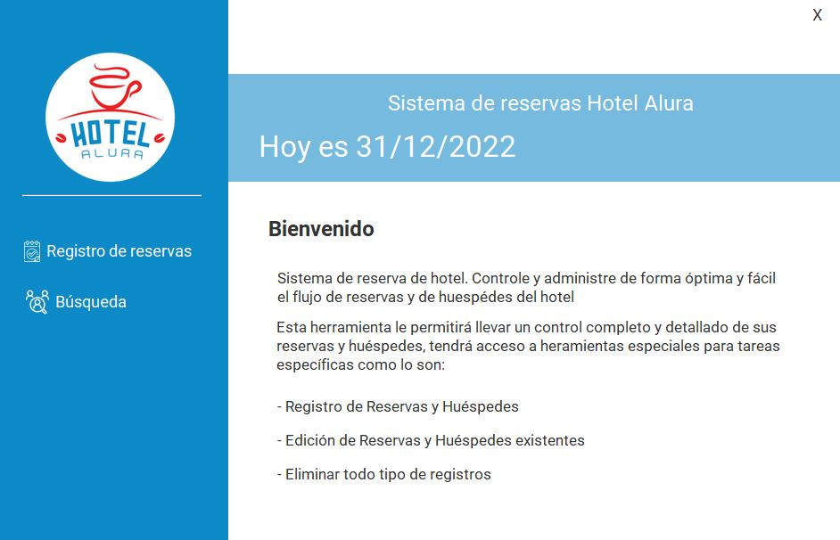
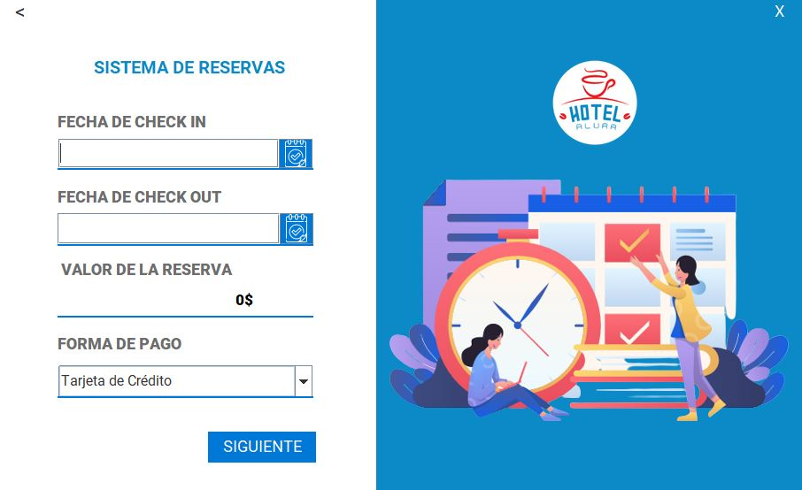
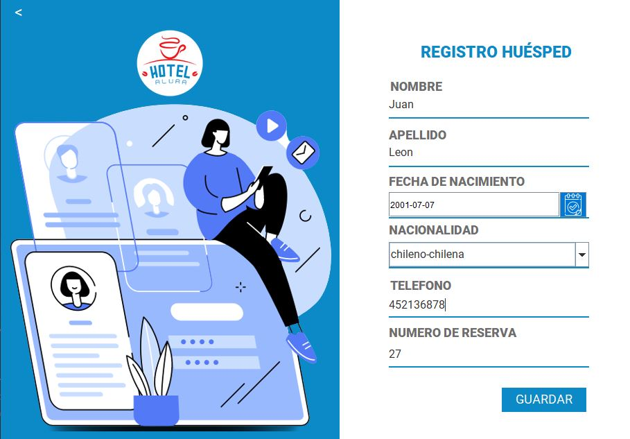
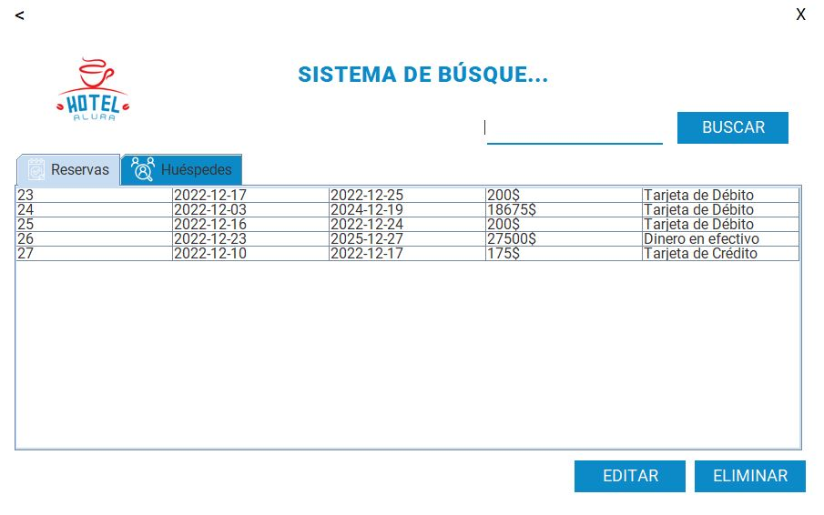

# Hotel Alura
Este proyecto forma parte del sexto challenge de Oracle ONE.
El proyecto consiste en crear un sistema de reservas para un hotel con MySql JDBC para la base de datos.
Para el desarrollo del conversor se usó el estilo Modelo vista controlador (MVC).

## Uso
Dentro del proyecto encontraras dos archivos los cuales debes usar para este proyect;
 
1. El primero que verás es "baseUsadaParaElHotelAlura.sql".
2. Una vez creada muestra base de datos usando el archivo anterior.
3. Modificaremos el archivo "ConnectionFactory.java" con los datos para conectar a la base de datos ya creada.
4. Y listo ya podremos usar nuestro Hotel Alura.

## Views
- Login

- Menú

- Reserva

- Huésped

- Búsqueda

###### Autor Jhordy
